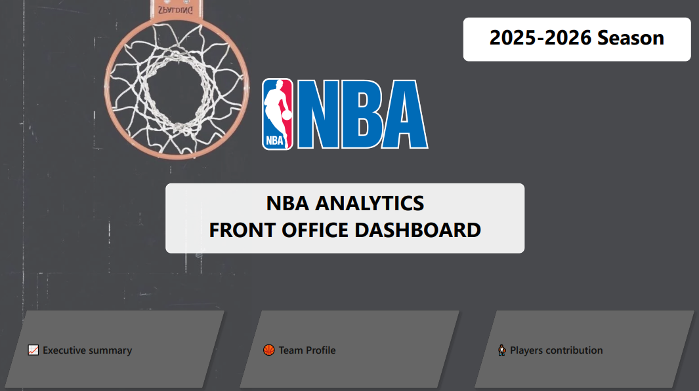

# Nba Front Office dashboard (2025-26 Season)

## Project overview
This project develops an NBA front-office analytics dashboard designed to support decision-making during the offseason. The objective is to combine on-court team and player performance with salary information from the 2025-26 season to create a tool that supports offseason decisions regarding players contracts.

## Buisness Questions:
The main questions driving this project are as follows:
- How did the team perform this season?
- What is the current Team Profile (Offense/Defense/Both) ?
- How did the players contribute to the team's success and deliver value relative to their contracts? 

## Data 
We retrieved performance data directly using the [nba_api](https://github.com/swar/nba_api/blob/master/README.md) Python library and salary data via ESPN.

## Dashboard

The Power BI dashboard is structured into three complementary pages:

### 1.Executive Summary
League-wide overview of team performance and financial context.

### 2.Team Profile
Detailed analysis of a selected team's offensive and defensive profile.

### 3.Roster & Player Value
Analysis of player contribution and salary alignment.

[Click here to access the interactive dashboard](https://app.powerbi.com/reportEmbed?reportId=50b4a8f4-847e-4579-8583-50e5e7fb7b61&autoAuth=true&ctid=3e08a669-4292-42cb-aaff-083b43a0d551)

## Key Metrics
With all the data available, it is easy to fall into the trap of treating every stat as relevant — which is not the case. For that reason, we made the deliberate decision to include only the data that helps answer our core questions. To complement the raw NBA stats, we also constructed several composite metrics to help evaluate teams and players:

**Offensive Score**  
League-relative 0–100 index based on Offensive Rating, TS%, 3P%, and turnover rate.

**Defensive Score**  
League-relative 0–100 index based on Defensive Rating and Defensive Rebound%.

**Contribution Index**  
Composite indicator combining selected player performance metrics.

**Value Gap**  
Contribution Percentile − Salary Percentile  

*Used to identify potential value opportunities and inefficient contracts.*

Details about the data used can be found in the data_inventory.md file.

## Data tools
|Tool|Purpose|
| --- | --- |
|Python (pandas, nba_api)|Data collection & cleaning|
|SQL (BigQuery)|Data transformation & analytical views|
|Power BI |Dashboard and Data visualisation|

## Limitations
Data covers the 2025–26 regular season. Salary information was collected separately from ESPN.com and may be incomplete for certain players or contracts, so payroll figures should be treated as estimates. Custom performance and value metrics are analytical indicators developed for this project and should be interpreted with caution, given their subjective nature.

## Project structure

The project is organized to separate raw data, data preparation, analysis, database transformations, and the final dashboard. This makes the workflow easier to understand, reproduce, and maintain, while keeping the different stages of the project clearly separated.

- **README.md** — project overview, business questions, dashboard, key metrics, tools, and limitations.
- **data_inventory.md** — concise inventory of the datasets used in the project: dataset/table names, source, main variables, period, and their role in the analysis. It provides a quick reference for understanding the data without going through the notebooks.
- **requirements.txt** — list of Python libraries required to run the data collection and processing notebooks, allowing the Python environment to be reproduced.
- **data_raw/** — original datasets collected from external sources, kept unchanged.
- **data_cleaned/** — cleaned and analysis-ready datasets used for the database/dashboard.
- **python_notebooks/** — notebooks for data collection, cleaning, transformation, and preparation.
- **sql_bigquery_scripts/** — SQL scripts used to create tables, transformations, metrics, and analytical views in BigQuery.
- **dashboard/** — Power BI dashboard file and any related dashboard assets.